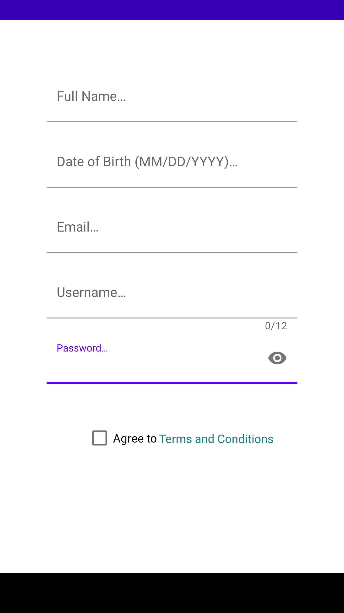
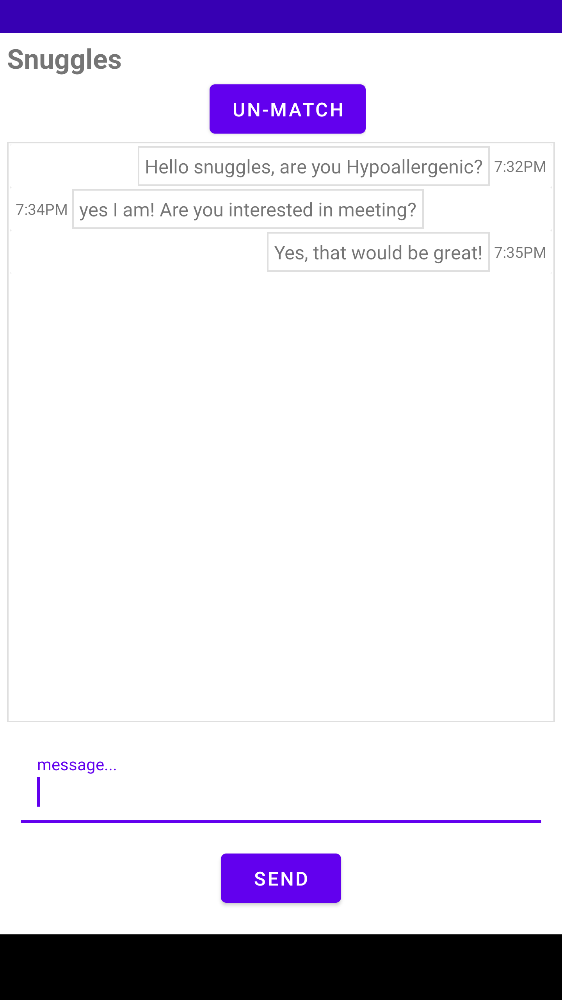
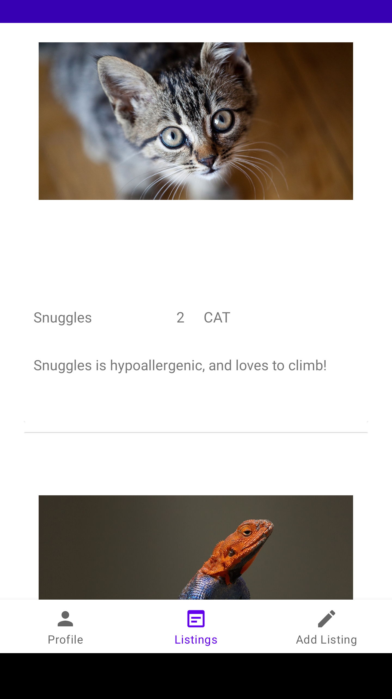
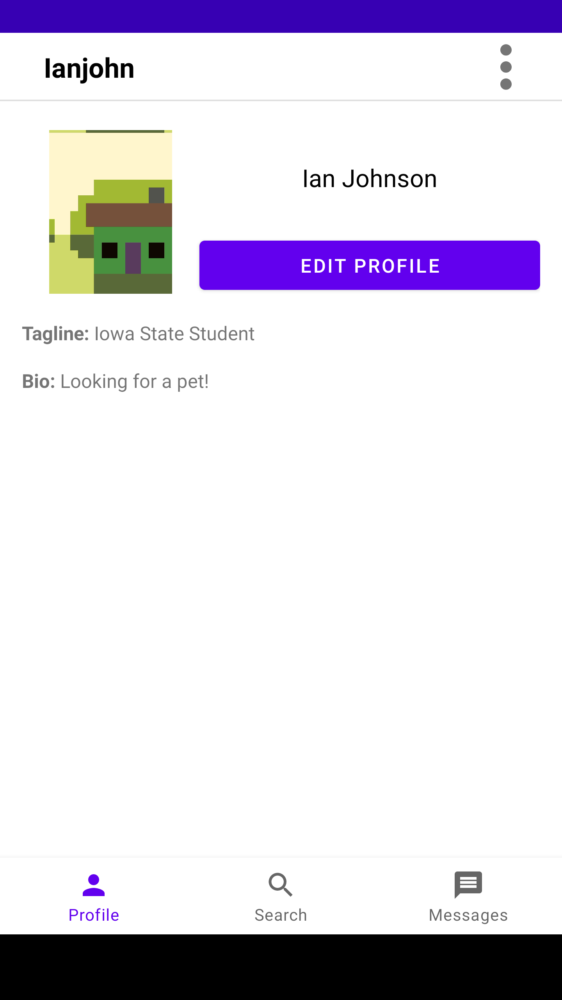
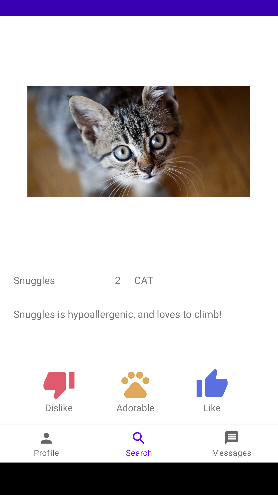

# Pet-Finder
## Created by:
### Alex Blomquist, Bailey Gorlewski, Ian Johnson, & Zach Hirst

## Table of Contents
* [General Info](#general-info)
* [Inspiration](#inspiration)
* [Technologies](#technologies)
* [Images](#images)
* [Features](#features)

## General Info
This project is for the Iowa State University ComS 309 course taken Fall of 2021. 
This project facilitates the adoption of animals. Shelters can upload profiles of animals that they would put up for adoption; these profiles are called pet listings. Users can log onto the app and begin swiping through listings until they come across a pet they would like to learn more information on. The user can like or spend an adorable action to super like the pet. This action matches the pet listing to the user. Upon a match, shelters and users can communicate more adoption details.

## Inspiration
The inspiration for this app include animal shelters across the United States. 
Lonely People looking for a pet to love and the dating/networking app Tinder. 

## Technologies 
The technologies used in this project are:
* Java
* Springboot 
* Maven
* Git 

## Images
    

    

# Features
* Password Hashing
* All users have the same login page
* Images are uploaded to Imgur using their API
* Images are converted to a bitmap, Base64 and then uploaded to the server
* Websocket kicks user out of chat if the server is down
* On an unmatch chats notify the user
* Chats are sent and received via websockets (in real time)

Users Features:
* create profiles with bios/tagline/picture
* register new accounts
* edit said profile
* change pet preferences via the settings page
* swipe on pets they like
* “superlike” pets they want to be the top of the queue for
* dislike pets they do not like
* message shelters about the pets they have messaged
* reset their password via the login page
* Unmatch with shelters

Shelter Features: 
* create profiles with a description and pictures
* register new accounts
* Upload pet listings with pictures
* Edit pet listings
* Delete pet listings
* View users who have matched with their pets
* Message users who have matched with their pets
* Delete listings
* Unmatch with users
