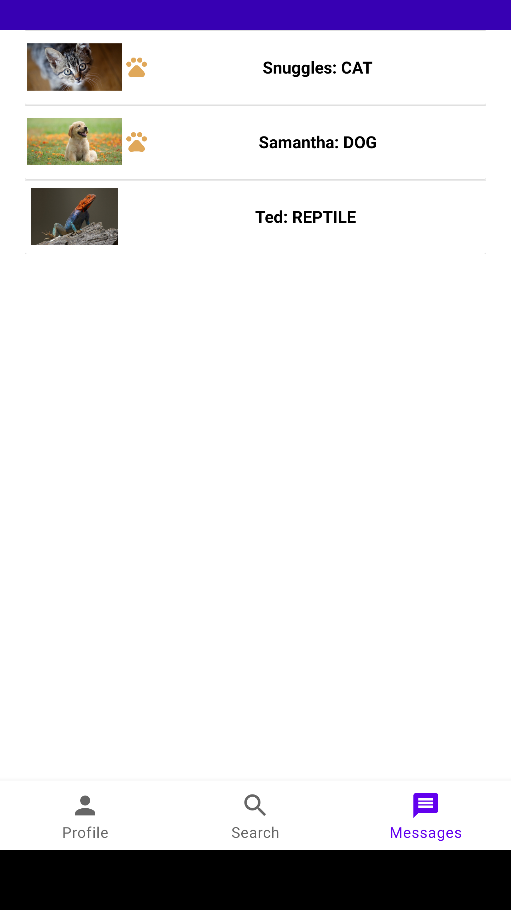

# 1_CW_8
## Created by:
### Alex Blomquist, Bailey Gorlewski, Ian Johnson, & Zach Hirst

## Table of Contents
* [General Info](#general-info)
* [Inspiration](#inspiration)
* [Technologies](#technologies)
* [Images](#images)

## General Info
This project is for the Iowa State University ComS 309 course taken Fall of 2021. 

## Inspiration
The inspiration for this app include animal shelters across the United States. 
Lonely People looking for a pet to love and the dating/networking app Tinder. 

## Technologies 
The technologies used in this project are:
* Java
* Springboot 
* Maven
* Git 

## Images
    

    

